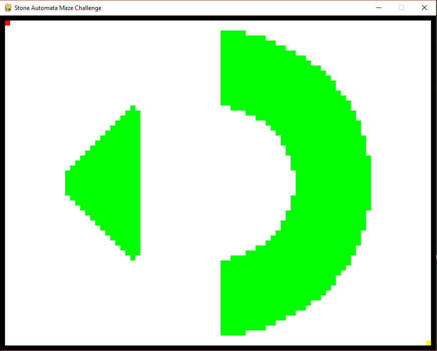

# Automata Maze Challenge

> Stone Automata Maze Challenge

This challenge was created by Stone and posted on: https://sigmageek.com/solution/stone-automata-maze-challenge

## About the maze:

The maze changes always there is a movement from the player. However it has a peculiarity, when the player moves, the maze changes before the player arrives at the new position. Therefore, the player needs to "predict" that the new position will be valid (blank space), otherwise, if he lands in a prohibited space (green space), he loses the game.

## Goal:

Submit all the necessary coordinates to reach the end of the maze.

## Methods and attempts:

Initially I created the game via terminal and tried a few ways.

Unsuccessfully, I used the pygame module to be able to play using NEAT neural networks, but I didn't complete it. I chose to switch to PyTorch, based on a model used for the 'snake' game.

I put more than one player for the AI ​​to play, but it weighed too much on my pc and it still didn't find the way.

Finally, I created a "cellular" model where a player starts and that player multiplies in all
possible movement options. Afterwards, each player does the same, until one reaches the end of the maze, ending the game and returning the answer with the commands performed.

### Model via terminal, with 0's and 1's (stone_pelo_terminal/stone.py)
- The simplest model and I also created some ways to play:
-- individual commands
-- random autocommands
-- a predefined initial sequence and then followed by random command or individual commands

This game models need to be changed in the stone.py file.
I also set it to update a CSV to save previous commands and during auto attempts not trying the same movements.

### Template via Pygame:
- Individual (stone_pygame/stone_pygame.py)
- Game by AI (stone_pygame_ia/)
-- unfinished NEAT version (NEAT/stone_pygame_ia.py)
-- PyTorch version, 1 player (game_single.py)
-- PyTorch version, 50 players (game.py)
- Cellular (stone_pygame_all/game_all.py)

[Click here to see the 'cellular game' video](https://www.youtube.com/watch?v=gXJsaNt7J_A)

## Technologies

- Python
- Pygame
- Pytorch

## Contact

Linkedin: https://www.linkedin.com/in/bruno-della-volpe-alves/